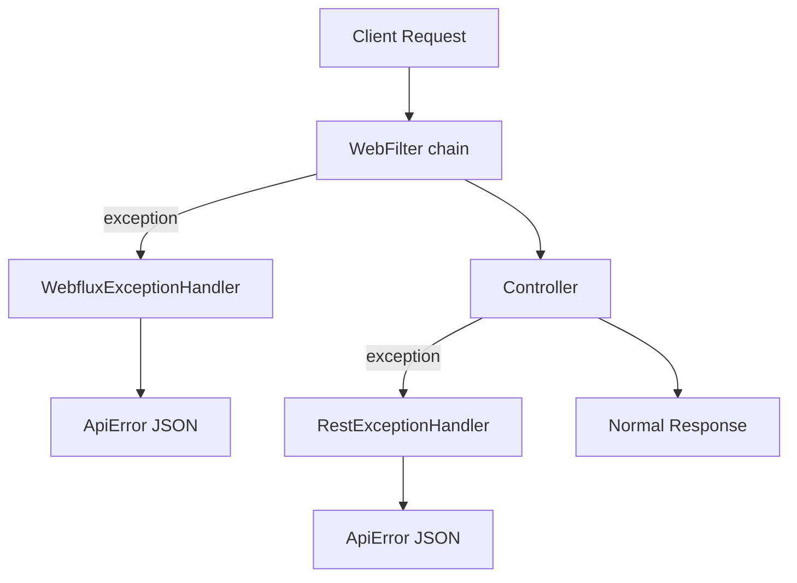

# Exception Handling

> **DEPRECATED**: This library has been split into:
>
> - [`exception-core`](https://github.com/phorus-group/exception-core): Sealed exception hierarchy (BadRequest, NotFound, Unauthorized, etc.) with HTTP status codes.
> - [`exception-spring-boot-starter`](https://github.com/phorus-group/exception-spring-boot-starter): Spring Boot autoconfiguration that catches exceptions from controllers and WebFilters, produces structured JSON error responses, and integrates with validation, metrics, and OpenAPI.
>
> This library will not receive further updates. Please migrate to the replacements above.

[](https://www.apache.org/licenses/LICENSE-2.0)
[](https://mvnrepository.com/artifact/group.phorus/exception-handling)

Exception handling library for Spring Boot WebFlux services. Catches exceptions from both
controllers and WebFilters, converts them to structured JSON responses with proper HTTP status
codes, and provides built-in validations, logging, metrics, and OpenAPI integration.

### Notes

> The project runs a vulnerability analysis pipeline regularly,
> any found vulnerabilities will be fixed as soon as possible.

> The project dependencies are being regularly updated by [Renovate](https://github.com/phorus-group/renovate).
> Dependency updates that don't break tests will be automatically deployed with an updated patch version.

> The project has been thoroughly tested to ensure that it is safe to use in a production environment.

## Table of contents

- [Exception handling in Spring WebFlux](#exception-handling-in-spring-webflux)
- [Features](#features)
- [Getting started](#getting-started)
  - [Installation](#installation)
  - [Quick start](#quick-start)
- [Exception classes](#exception-classes)
- [Validation](#validation)
- [WebFilter exceptions](#webfilter-exceptions)
- [Logging](#logging)
- [Metrics](#metrics)
- [OpenAPI integration](#openapi-integration)
- [Building and contributing](#building-and-contributing)
- [Authors and acknowledgment](#authors-and-acknowledgment)

***

## Exception handling in Spring WebFlux

If you are already familiar with this, feel free to skip to [Features](#features).

Spring WebFlux has two layers where exceptions can occur, and it only partially handles them
out of the box.

`@RestControllerAdvice` catches exceptions thrown inside controller methods, but exceptions from
WebFilters (authentication filters, rate limiting, etc.) happen *before* the request reaches a
controller and bypass it entirely. Those produce generic framework responses with no structured
body.

On top of that, even for controller exceptions, Spring's default handling returns different formats
depending on the exception type. Validation errors, type mismatches, database constraint violations,
and business logic exceptions all produce different responses.

This library registers two handlers that cover both layers, converting every exception into a
consistent `ApiError` JSON response with the correct HTTP status code:



Everything is autoconfigured. Add the dependency and it will work out of the box.

## Features

- **Sealed exception hierarchy**: throw `BadRequest("message")`, `NotFound("message")`, etc. and the correct HTTP status is set automatically
- **Two-layer handling**: `RestExceptionHandler` catches controller exceptions, `WebfluxExceptionHandler` catches filter and framework exceptions
- **Bean validation**: supports `@Valid` on request bodies, collections, and Kotlin `suspend` functions with correct parameter names
- **Database conflict detection**: `DataIntegrityViolationException` is caught and returned as `409 Conflict`
- **Unhandled exception safety net**: any uncaught exception returns `500` with a generic message, no stack trace leak
- **Configurable logging**: all exceptions logged at debug level, unhandled exceptions at error level
- **Optional metrics**: exception counters via [metrics-commons](https://github.com/phorus-group/metrics-commons), enabled by default when Actuator is present
- **OpenAPI integration**: automatically registers `ApiError` and `ValidationError` schemas when springdoc is on the classpath
- **Zero configuration**: add the dependency and everything is registered via autoconfiguration

## Getting started

### Installation

Make sure that `mavenCentral` (or any of its mirrors) is added to the repository list of the project.

Binaries and dependency information for Maven and Gradle can be found at [http://search.maven.org](https://search.maven.org/search?q=g:group.phorus%20AND%20a:exception-handling).

<details open>
<summary>Gradle / Kotlin DSL</summary>

```kotlin
implementation("group.phorus:exception-handling:x.y.z")
```
</details>

<details open>
<summary>Maven</summary>

```xml
<dependency>
    <groupId>group.phorus</groupId>
    <artifactId>exception-handling</artifactId>
    <version>x.y.z</version>
</dependency>
```
</details>

### Quick start

Add the dependency and throw exceptions from your controllers:

```kotlin
@RestController
class UserController(private val userService: UserService) {

    @GetMapping("/user/{id}")
    suspend fun findById(@PathVariable id: UUID): UserResponse =
        userService.findById(id) ?: throw NotFound("User with id $id not found")

    @PostMapping("/user")
    suspend fun create(@RequestBody @Valid request: CreateUserRequest): ResponseEntity<Void> {
        val id = userService.create(request)
        return ResponseEntity.created(URI.create("/user/$id")).build()
    }
}
```

If the user is not found, the client receives:

```json
{
  "timestamp": "06-03-2026 10:30:00",
  "status": "NOT_FOUND",
  "message": "User with id 550e8400-e29b-41d4-a716-446655440000 not found"
}
```

If validation fails on the `@Valid` request body:

```json
{
  "timestamp": "06-03-2026 10:30:00",
  "status": "BAD_REQUEST",
  "message": "Validation error",
  "validationErrors": [
    {
      "obj": "createUserRequest",
      "field": "email",
      "rejectedValue": null,
      "message": "Cannot be blank"
    }
  ]
}
```

No additional configuration is needed.

## Exception classes

The library provides a sealed `BaseException` class and concrete subclasses for common HTTP errors:

```kotlin
throw BadRequest("Invalid input")           // 400
throw Unauthorized("Token expired")         // 401
throw Forbidden("Insufficient privileges")  // 403
throw NotFound("User not found")            // 404
throw MethodNotAllowed("Use POST")          // 405
throw RequestTimeout("Upstream timeout")    // 408
throw Conflict("Email already exists")      // 409
throw Gone("Resource deleted")              // 410
throw PreconditionFailed("ETag mismatch")   // 412
throw UnsupportedMediaType("Use JSON")      // 415
throw UnprocessableEntity("Invalid data")   // 422
throw TooManyRequests("Rate limited")       // 429
throw InternalServerError("Unexpected")     // 500
throw BadGateway("Upstream error")          // 502
throw ServiceUnavailable("Maintenance")     // 503
throw GatewayTimeout("Upstream timeout")    // 504
```

All extend `BaseException(message, httpStatus)` which extends `RuntimeException`. They can be thrown
from controllers, services, WebFilters, anywhere in your code. The handlers catch them and return
the correct HTTP status code.

```kotlin
val user = userRepository.findByEmail(email)
    ?: throw NotFound("User with email $email not found")

if (!passwordMatches) {
    throw Unauthorized("Invalid credentials")
}

if (emailExists) {
    throw Conflict("User with email $email already exists")
}
```

## Validation

Use `@Valid` on request body parameters with Jakarta validation annotations on your DTOs:

```kotlin
data class CreateUserRequest(
    @field:NotBlank(message = "Cannot be blank")
    val name: String?,

    @field:NotBlank(message = "Cannot be blank")
    @field:Email(message = "Invalid email format")
    val email: String?,

    @field:NotEmpty(message = "Cannot be empty")
    val subObjectList: List<SubObject>?,
)

@PostMapping("/user")
suspend fun create(@RequestBody @Valid request: CreateUserRequest) = ...
```

All validation errors are collected at once and returned in a single response. The library validates
every field, every nested object, and every collection item, then reports all violations together:

```json
{
  "timestamp": "06-03-2026 10:30:00",
  "status": "BAD_REQUEST",
  "message": "Validation error",
  "validationErrors": [
    {
      "obj": "createUserRequest",
      "field": "name",
      "rejectedValue": "",
      "message": "Cannot be blank"
    },
    {
      "obj": "createUserRequest",
      "field": "email",
      "rejectedValue": null,
      "message": "Cannot be blank"
    },
    {
      "obj": "createUserRequest",
      "field": "subObjectList",
      "rejectedValue": [],
      "message": "Cannot be empty"
    }
  ]
}
```

Nested object fields are reported with dot-separated paths (e.g. `subObject.testVar`), so the
client knows exactly where the error is even in deeply nested structures.

Collections are also supported. Add `@Validated` to the controller class and `@Valid` to the
collection parameter:

```kotlin
@RestController
@Validated
class ItemController {

    @PostMapping("/items")
    suspend fun createBatch(
        @RequestBody @Valid @NotEmpty(message = "Cannot be empty")
        items: List<ItemDTO>,
    ): List<ItemResponse> = ...
}
```

Each item in the list is validated individually with proper field paths in the response.

The library also fixes Spring's parameter name discovery for Kotlin `suspend` functions. Spring's
default resolver gets confused by the continuation parameter, which breaks validation annotations
on suspend controller methods. The library's `WebfluxValidatorConfig` handles this transparently.

## WebFilter exceptions

`@RestControllerAdvice` only catches exceptions thrown inside controller methods. Exceptions from
WebFilters happen before the request reaches a controller, so they bypass it entirely.

The library's `WebfluxExceptionHandler` (registered with `@Order(-2)`) catches these and returns
the same `ApiError` JSON:

```kotlin
@Component
class AuthenticationFilter : WebFilter {
    override fun filter(exchange: ServerWebExchange, chain: WebFilterChain): Mono<Void> {
        val authHeader = exchange.request.headers.getFirst("Authorization")
            ?: throw Unauthorized("Authorization header is missing")

        if (!hasRequiredPermissions(parseToken(authHeader))) {
            throw Forbidden("Insufficient permissions")
        }

        return chain.filter(exchange)
    }
}
```

Without the library, these exceptions would produce generic framework responses. With it, the
client receives structured JSON:

```json
{
  "timestamp": "06-03-2026 10:30:00",
  "status": "UNAUTHORIZED",
  "message": "Authorization header is missing"
}
```

## Logging

All caught exceptions are logged before being returned to the client. Business exceptions
(`BaseException`, validation errors, type mismatches) are logged at **debug** level. Unhandled
exceptions that fall through to the generic `Exception` handler are logged at **error** level
with full stack traces.

You can configure the log level for the exception handling library using:

```yaml
logging:
  level:
    group.phorus.exception.handling: DEBUG
    # group.phorus.exception.handling: ERROR
```

## Metrics

The library integrates with [metrics-commons](https://github.com/phorus-group/metrics-commons) to
record exception counters. Every caught exception increments a counter named
`http.server.exceptions` with the following tags:

| Tag | Example values |
|-----|---------------|
| `TagNames.TYPE` | `NotFound`, `BadRequest`, `ValidationException` |
| `TagNames.STATUS_CODE` | `404`, `400`, `500` |
| `TagNames.STATUS_FAMILY` | `4xx`, `5xx` |

Metrics are **enabled by default** when `MeterRegistry` is on the classpath (via Spring Boot
Actuator). To disable them:

```yaml
phorus:
  exception-handling:
    metrics:
      enabled: false
```

## OpenAPI integration

If [springdoc-openapi](https://springdoc.org/) is on the classpath, the library automatically
registers `ApiError` and `ValidationError` schemas in the OpenAPI components and adds error
responses (400, 401, 403, 404, 408, 409, 500) to every endpoint that doesn't already define them.

This is especially useful with code generators like [Orval](https://orval.dev/), which can use the
`ApiError` type to provide correctly typed error handling in the frontend.

The integration is conditional, if you don't use springdoc, nothing happens.

## Building and contributing

See [Contributing Guidelines](CONTRIBUTING.md).

## Authors and acknowledgment

Developed and maintained by the [Phorus Group](https://phorus.group) team.
